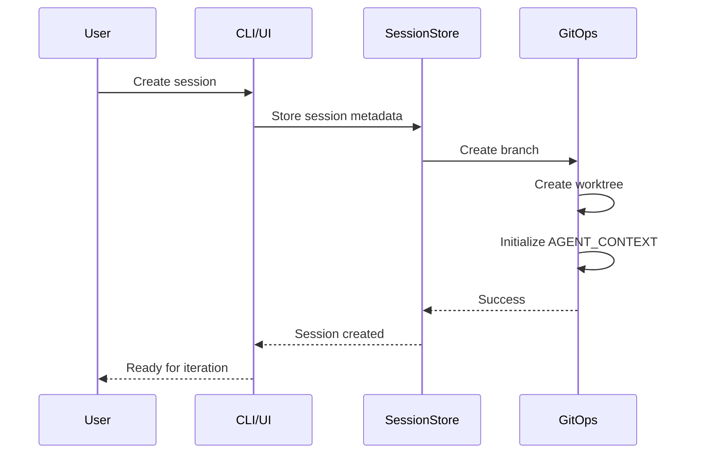
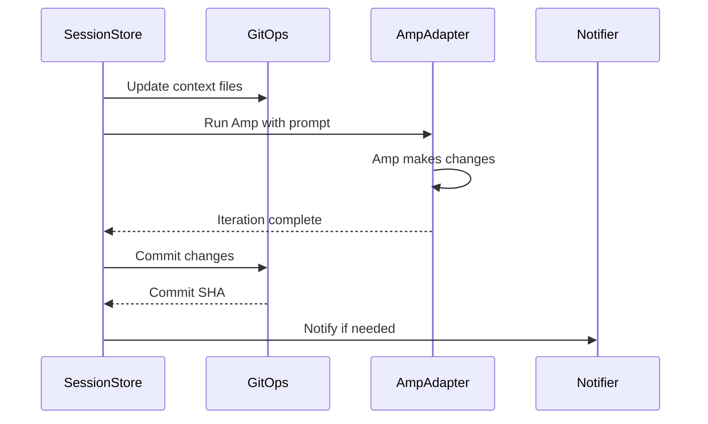

# Architecture

Amp Session Orchestrator is built as a monorepo with clear separation between UI, business logic, and CLI interfaces.

## System Overview

```mermaid
graph TB
    subgraph "Desktop App"
        UI[React UI]
        Main[Electron Main]
        Preload[Preload Scripts]
    end
    
    subgraph "Core Engine"
        Store[SessionStore]
        Git[GitOps]
        Amp[AmpAdapter]
        Notifier[Notifier]
    end
    
    subgraph "CLI"
        CLI[amp-sessions]
        Commands[Commands]
    end
    
    subgraph "Storage"
        SQLite[(SQLite DB)]
        Worktrees[Git Worktrees]
        Repos[Target Repos]
    end
    
    UI --> Main
    Main --> Store
    CLI --> Store
    Store --> SQLite
    Git --> Worktrees
    Git --> Repos
    Amp --> Worktrees
    
    Store --> Git
    Store --> Amp
    Store --> Notifier
```

## Package Structure

### @ampsm/types
Shared TypeScript interfaces and types used across all packages.

**Key Types:**
- `Session`: Core session data model
- `IterationRecord`: Records of Amp iterations
- `SessionCreateOptions`: Session creation parameters

### @ampsm/core
Business logic engine containing all session management functionality.

**Key Components:**
- `SessionStore`: SQLite-based persistence layer
- `GitOps`: Git worktree and branch operations
- `AmpAdapter`: Interface to Amp CLI
- `Notifier`: Cross-platform notifications

### @ampsm/cli
Command-line interface for scripting and automation.

**Key Features:**
- Session CRUD operations
- Iteration management
- Squash and rebase workflows
- Batch operations

### @ampsm/desktop
Electron-based desktop application with React UI.

**Key Features:**
- Real-time session monitoring
- Visual diff review
- Notification management
- Session timeline view

## Data Flow

### Session Creation


### Amp Iteration


## File System Layout

```
<repo-root>/
├── .worktrees/
│   └── <session-id>/
│       ├── AGENT_CONTEXT/
│       │   ├── SESSION.md
│       │   ├── DIFF_SUMMARY.md
│       │   ├── ITERATION_LOG.md
│       │   └── LAST_STATUS.json
│       └── <project files>
└── <main branch files>
```

## Database Schema

```sql
-- Sessions table
CREATE TABLE sessions (
  id TEXT PRIMARY KEY,
  name TEXT NOT NULL,
  ampPrompt TEXT NOT NULL,
  repoRoot TEXT NOT NULL,
  baseBranch TEXT NOT NULL,
  branchName TEXT NOT NULL,
  worktreePath TEXT NOT NULL,
  status TEXT NOT NULL,
  scriptCommand TEXT,
  modelOverride TEXT,
  createdAt TEXT NOT NULL,
  lastRun TEXT,
  notes TEXT
);

-- Iterations table
CREATE TABLE iterations (
  id TEXT PRIMARY KEY,
  sessionId TEXT NOT NULL,
  startTime TEXT NOT NULL,
  endTime TEXT,
  commitSha TEXT,
  changedFiles INTEGER DEFAULT 0,
  testResult TEXT,
  testExitCode INTEGER,
  tokenUsage INTEGER,
  FOREIGN KEY(sessionId) REFERENCES sessions(id)
);
```

## Security Considerations

- Never read `.env` files without explicit user instruction
- Redact secrets in logs and commit messages
- Validate all Git operations before execution
- Sanitize user input for shell commands
- Use absolute paths to prevent directory traversal

## Performance Optimizations

- Lazy-load session data in UI
- Batch Git operations where possible
- Use SQLite transactions for consistency
- Stream large diff outputs
- Debounce file system watchers

## Error Handling

- Graceful degradation when Git operations fail
- Clear error messages for user actions
- Automatic rollback of failed operations
- Conflict resolution guidance
- Recovery procedures for corrupted sessions

## Testing Strategy

- Unit tests for core business logic
- Integration tests for Git operations
- E2E tests for CLI workflows
- UI component testing with React Testing Library
- Database migration testing
